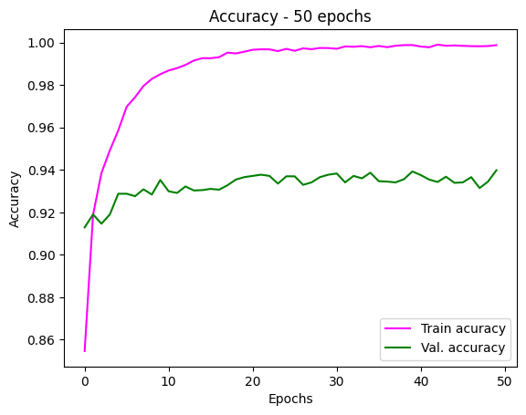
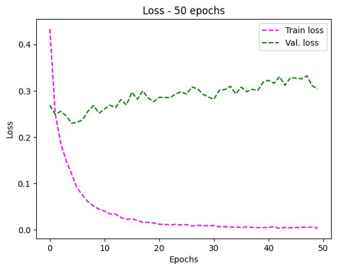
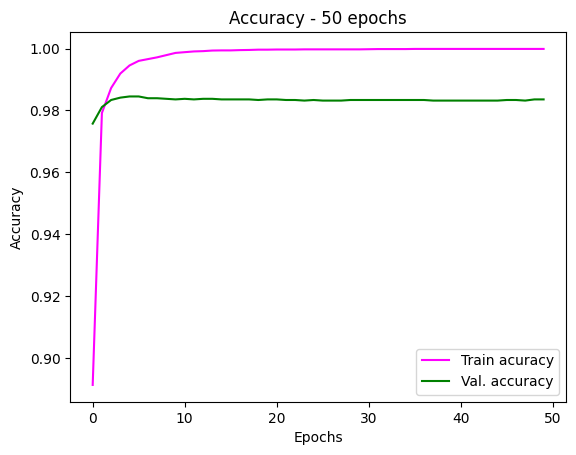
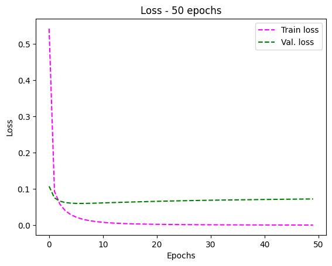

# Classificação de Imagens com Redes Neurais Convolucionais (CNNs)

Este repositório contém o projeto de classificação de imagens desenvolvido para a disciplina **SIN 393 - Visão Computacional (2024-2)**. O objetivo foi implementar, treinar e comparar o desempenho de diferentes arquiteturas de Redes Neurais Convolucionais (CNNs) utilizando o dataset **Animals10**, que inclui 10 classes de animais, como cães, gatos, cavalos e outros.

## **Descrição do Projeto**

Neste projeto, foram utilizadas duas arquiteturas de redes neurais:

1. **AlexNet**: Uma arquitetura pioneira que marcou o início do uso de CNNs em larga escala.
2. **ResNet-50**: Uma rede mais moderna, com blocos residuais para melhorar a capacidade de aprendizado e a generalização.

O treinamento e a avaliação dos modelos foram realizados no dataset **Animals10**, com foco nas métricas de acurácia, precisão, recall e F1-Score. As arquiteturas foram implementadas utilizando a biblioteca **PyTorch**, com suporte para execução em GPU (Google Colab).

---

## **Características do Projeto**

- **Dataset**: Animals10 ([disponível no Kaggle](https://www.kaggle.com/datasets/alessiocorrado99/animals10)).
- **Modelos pré-treinados**: Utilizamos modelos pré-treinados no ImageNet para AlexNet e ResNet-50.
- **Análise de Desempenho**:

  - Matrizes de confusão.
  - Curvas de aprendizado (perda e acurácia).

    ##### AlexNet:

     
    

    ##### ResNet:

    
    

  - Comparação detalhada das métricas entre as arquiteturas.

---

## **Requisitos e Dependências**

Certifique-se de ter as seguintes dependências instaladas no ambiente de execução:

- Python 3.8 ou superior.
- Bibliotecas:
  ```bash
  pip install numpy matplotlib torch torchvision scikit-learn kagglehub
  ```

---

## **Instruções para Execução**

1. **Clone este repositório**:

   ```bash
   git clone https://github.com/FelipeRodrigues662/CNNS_AlexNet_ResNet.git
   cd CNNS_AlexNet_ResNet
   ```

2. **Baixe o dataset**:
   Certifique-se de ter uma conta no Kaggle e configure sua API. Em seguida, execute o comando abaixo no Jupyter Notebook ou terminal para baixar o dataset:

   ```python
   import kagglehub
   ds_path = kagglehub.dataset_download("alessiocorrado99/animals10")
   print("Dataset baixado em:", ds_path)
   ```

3. **Prepare o ambiente**:

   - Verifique se sua máquina tem suporte a GPU (opcional para melhor desempenho).
   - Configure os hiperparâmetros no código, como número de épocas, tamanho do lote e taxa de aprendizado, se necessário.

4. **Execute os notebooks**:
   Utilize os arquivos fornecidos para treinar e avaliar os modelos:

   - Abra o arquivo `/colab/AlexNet.ipynb` para a preparação dos dados e definição do modelo.
   - Prossiga com o treinamento e avaliação no arquivo `/colab/ResNet.ipynb`.

5. **Visualize os resultados**:
   Após a execução, você encontrará:
   - Matrizes de confusão.
   - Gráficos de perda e acurácia.
   - Relatório detalhado com as métricas para cada modelo.

---

## **Informações importantes**

**Discentes e Matrículas**:

- Felipe Pereira Rodrigues (7610)
- Herbert Ribeiro Sampaio (7633)
- Luiz Davi Vieira Alves (6335)

**Link do relatório completo**:

- [Relatório Projeto Final Visão Computacional](./Relatório/RelatórioSIN393_ProjetoFinal__7633_7610_6335_.pdf)

**Link do vídeo de apresentação**:

- [Link do vídeo da apresentação no Youtube](https://www.youtube.com)

---

## **Licença**

Este projeto foi utilizado para fins de estudos e avaliação da disciplina optativa SIN 393 - Visão Computacional da UFV - CRP. Em caso de cópia ou utilização sem autorização deste projeto, medidas legais serão tomadas.
